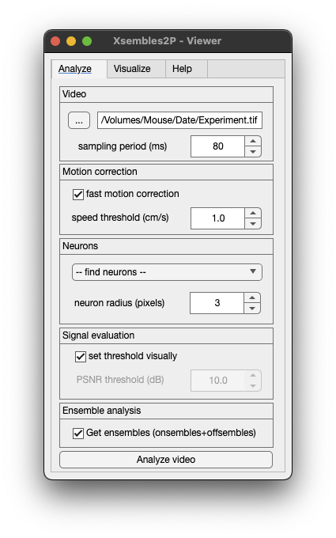
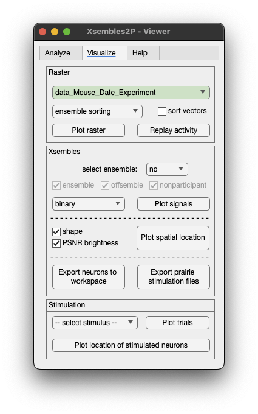

# Xsembles2P
**_Xsembles2P_** is a faster<sup>†</sup> tool to analyze two-photon calcium imaging videos to extract neuronal activity and identify ensembles (onsembles and offsembles).  The MATLAB function to use it is `Xsembles_2P.m`.

The algorithm performs the following computations:

1. Read raw video(s).
2. Read external voltage recording file(s).
3. Perform registration (based on animal locomotion).
4. Find active neurons.
5. Get calcium signals.
6. Do spike inference.
7. Get population activity (binary raster).
8. Find ensembles<sup>††</sup> (onsembles and offsembles).
9. Save results.
10. Plot results.

<sup>†</sup> For example, a 5 minute long video of 256x256 pixels at 12.5 frames per second where the animal ran 50% of the time, the entire analysis will take less than 10 minutes in a usual personal computer. Motion correction consumes most of the time, but, if you do not need to perform it, this analysis can last just a couple of minutes. This tool is very convenient if you want to perform online targeting of ensemble neurons during your experiment.

<sup>††</sup> Unsupervised model-free algorithm which identifies statistically significant repeated activity patterns in population vectors where each pattern includes an onsemble (active neurons) and its associated offsemble (silenced neurons).

[Xsembles2P repository traffic](https://app.repohistory.com/PerezOrtegaJ/Xsembles2P)

## Citation
If you use **_Xsembles2P_**, please cite our papers [NatComms](https://www.nature.com/articles/s41467-024-47515-x) and/or [eLife](https://elifesciences.org/articles/64449):
> Pérez-Ortega, J., Akrouh, A. & Yuste, R. 2024. Stimulus encoding by specific inactivation of cortical neurons. Nat Commun 15, 3192. doi: 10.1038/s41467-024-47515-x

> Pérez-Ortega J, Alejandre-García T, Yuste R. 2021. Long-term stability of cortical ensembles. Elife 10:1–19. doi:10.7554/eLife.64449

## How to run Xsembles2P
You will need a raw calcium imaging video (_TIF_ or _AVI_ file format). Then, select your file when you run the function without any extra input arguments (using the default properties). Here are three options to do it:

```matlab
Xsembles_2P()
```
or
```matlab
Xsembles_2P('')
```
or
```matlab
Xsembles_2P(filepath)
```

You can specify some parameters in the function arguments, for example, a samplig period to 0.1 seconds and a neuron radius size of 4 pixels:
```matlab
Xsembles_2P('','SamplingPeriod',0.1,'NeuronRadius',4)
```

#### Name-Value Arguments
- `NeuronRadius`, neuron radius in pixels (default is `3`).
- `SamplingPeriod`, sampling period in seconds (default is `0.1`).
- `OutputPath`, string of the output path (default is `''`).
- `MotionCorrection`, flag to perform motion correction (default is `true`).
- `MotionCorrectionThreshold`, motion correction is based on animal running speed above of this threshold in cm/s (default is `1`).
- `SpatialMaskBinning`, binning of spatial mask in seconds (default is `1`).
- `SelectPSNRThresholdVisually`, flag to select neurons visually based on Peak-Signal-To-Noise-Ratio (PSNR) (default is `false`).
- `PSNRdBThreshold`, PSNR threshold to select neurons (default is `20`).
- `InferenceMethod`, method to perform inference of spikes (default is `'foopsi'`).
- `MaxIterationsFoopsi`, maximum number of iterations to run `'foopsi'` algorithm (default is `2`).
- `InferenceThreshold`, threshold of spike inference to buil a binary raster (default is `0`).
- `SameInferenceThreshold`, flag to apply the same threshold to all neurons (default is `true`).
- `Neurons`, structure variable with neuron ROIs (when ROIs are given the program will not find new ones, default is `[]`).
- `GetXsembles`, flag to perform the extaction of ensembles (onsembles and offsembles) (default is `true`).

# Xsembles2P - Viewer
**_Xsembles2P - Viewer_** is a friendly graphical user interface for running `Xsembles_2P.m` and also for plotting the results generated. The MATLAB function to use it is `Xsembles_2P_Viewer.m`.

1. Open the GUI:
```matlab
Xsembles_2P_Viewer
```


2. Then, click on the button `...` to find and select the video that you want to analyze.
3. Specify the parameters and click the button `Analyze video`.
4. Once the video is analyzed, you can plot the raster with the ensembles clicking the button `Plot raster`.



This is an example of an experiment with visual stimuli of drifting gratings in 8 different directions. Note that this algorithm is not using stimuli information to extact ensemble, stimuli information is optional to visualize and perform subsequent analysis.


You can plot the spatial location of neurons of a specific ensemble. Select the ensemble from the dropdown menu `highlight xsemble` and click `Plot spatial location`.


To plot the calcium signal of an individual neuron, just click on the neuron ROI.


## Results are saved in a structure variable `data`
The structure variable `data` contains the following information:

<details><summary>data.Movie</summary>

  - data.Movie.FilePath
  - data.Movie.FileName
  - data.Movie.DataName
  - data.Movie.Width
  - data.Movie.Height
  - data.Movie.Depth
  - data.Movie.Frames
  - data.Movie.FPS
  - data.Movie.Period
  - data.Movie.ImageMaximum
  - data.Movie.ImageAverage
  - data.Movie.ImageSTD
  - data.Movie.ImagePSNR
  - data.Movie.Summary  
</details>
<details><summary>data.ROIs</summary>

  - data.ROIs.CellRadius
  - data.ROIs.AuraRadius
  - data.ROIs.EvaluationCriteria
    - data.ROIs.EvaluationCriteria.MinimumPixels
    - data.ROIs.EvaluationCriteria.MaximumPixels
    - data.ROIs.EvaluationCriteria.Outline
    - data.ROIs.EvaluationCriteria.MinimumCircularity
    - data.ROIs.EvaluationCriteria.MaxPerimeter
    - data.ROIs.EvaluationCriteria.MaxEccentricity
  - data.ROIs.CellMasksImage
  - data.ROIs.CellWeightedMasksImage
  - data.ROIs.AuraMasksImage
  - data.ROIs.NeuropilMask
</details>
<details><summary>data.VoltageRecording</summary>

  - data.VoltageRecording.Stimuli
  - data.VoltageRecording.Frequency
  - data.VoltageRecording.Locomotion
  - data.VoltageRecording.Laser
  - data.VoltageRecording.File
  - data.VoltageRecording.RecordingSampleRate
  - data.VoltageRecording.DownsampledTo
  - data.VoltageRecording.Method
</details>
<details><summary>data.Optogenetics</summary>

  - data.Optogenetics.File
  - data.Optogenetics.XY
  - data.Optogenetics.IsSpiral
  - data.Optogenetics.Revolutions
  - data.Optogenetics.RadiusMicrons
  - data.Optogenetics.RadiusPixels
  - data.Optogenetics.Stimulation
</details>

data.XY.All

<details><summary>data.Neurons</summary>

  - data.Neurons(i).pixels
  - data.Neurons(i).weight_pixels
  - data.Neurons(i).x_pixels
  - data.Neurons(i).y_pixels
  - data.Neurons(i).num_pixels
  - data.Neurons(i).x_median
  - data.Neurons(i).y_median
  - data.Neurons(i).overlap
  - data.Neurons(i).overlap_fraction
  - data.Neurons(i).Eccentricity
  - data.Neurons(i).Circularity
  - data.Neurons(i).Perimeter
  - data.Neurons(i).PSNRdB
</details>
<details><summary>data.Transients</summary>

  - data.Transients.Raw
  - data.Transients.Filtered
  - data.Transients.Smoothed
  - data.Transients.F0
  - data.Transients.Field
  - data.Transients.Cells
  - data.Transients.PSNRdB
  - data.Transients.Preprocessed
  - data.Transients.Preprocessing
  - data.Transients.Inference
  - data.Transients.Model
  - data.Transients.InferenceMethod
  - data.Transients.ThresholdPSNR
  - data.Transients.Raster
  - data.Transients.InferenceTh
  - data.Transients.SameThreshold
  - data.Transients.Threshold
</details>
<details><summary>data.DiscardedNeurons</summary>

  - data.DiscardedNeurons(i).pixels
  - data.DiscardedNeurons(i).weight_pixels
  - data.DiscardedNeurons(i).x_pixels
  - data.DiscardedNeurons(i).y_pixels
  - data.DiscardedNeurons(i).num_pixels
  - data.DiscardedNeurons(i).x_median
  - data.DiscardedNeurons(i).y_median
  - data.DiscardedNeurons(i).overlap
  - data.DiscardedNeurons(i).overlap_fraction
  - data.DiscardedNeurons(i).Eccentricity
  - data.DiscardedNeurons(i).Circularity
  - data.DiscardedNeurons(i).Perimeter
  - data.DiscardedNeurons(i).PSNRdB 
</details>

data.Log

<details><summary>data.Analysis</summary>

  - data.Analysis.Options
    - data.Analysis.Options.Network
      - data.Analysis.Options.Network.Bin
      - data.Analysis.Options.Network.Iterations
      - data.Analysis.Options.Network.Alpha
    - data.Analysis.Options.Vectors
      - data.Analysis.Options.Vectors.CoactivityThreshold
    - data.Analysis.Options.Clustering
      - data.Analysis.Options.Clustering.Range
      - data.Analysis.Options.Clustering.Fixed
    - data.Analysis.Options.Ensemble
      - data.Analysis.Options.Ensemble.Iterations
  - data.Analysis.Raster
  - data.Analysis.Neurons
  - data.Analysis.Frames
  - data.Analysis.Network
  - data.Analysis.Filter
    - data.Analysis.Filter.RasterFiltered
    - data.Analysis.Filter.SpikesFractionRemoved 
    - data.Analysis.Filter.RasterVectors
    - data.Analysis.Filter.VectorID
  - data.Analysis.Clustering
    - data.Analysis.Clustering.Similarity
    - data.Analysis.Clustering.Tree
    - data.Analysis.Clustering.TreeID
    - data.Analysis.Clustering.Fixed
    - data.Analysis.Clustering.RecommendedClusters
    - data.Analysis.Clustering.ClusteringRange
    - data.Analysis.Clustering.ClusteringIndices
  - data.Analysis.Ensembles
    - data.Analysis.Ensembles.Count
    - data.Analysis.Ensembles.ActivationSequence
    - data.Analysis.Ensembles.Activity
    - data.Analysis.Ensembles.OnsembleActivity
    - data.Analysis.Ensembles.OffsembleActivity
    - data.Analysis.Ensembles.OnsembleNetworks
    - data.Analysis.Ensembles.OffsembleNetworks
    - data.Analysis.Ensembles.AllOnsembleNetwork
    - data.Analysis.Ensembles.AllOffsembleNetwork
    - data.Analysis.Ensembles.Vectors
    - data.Analysis.Ensembles.Indices
    - data.Analysis.Ensembles.VectorCount
    - data.Analysis.Ensembles.Similarity
    - data.Analysis.Ensembles.StructureOn
    - data.Analysis.Ensembles.StructureOff
    - data.Analysis.Ensembles.StructureTrinary
    - data.Analysis.Ensembles.StructureBelongingness
    - data.Analysis.Ensembles.StructureP
    - data.Analysis.Ensembles.StructureWeights
    - data.Analysis.Ensembles.StructureWeightsSignificant
    - data.Analysis.Ensembles.EPI
    - data.Analysis.Ensembles.Weights
    - data.Analysis.Ensembles.OnsembleNeurons
    - data.Analysis.Ensembles.OffsembleNeurons
    - data.Analysis.Ensembles.NeuronID
    - data.Analysis.Ensembles.VectorID
    - data.Analysis.Ensembles.Durations
    - data.Analysis.Ensembles.ContinuousActivationCount
    - data.Analysis.Ensembles.FrameActivationCount
    - data.Analysis.Ensembles.Probability
    - data.Analysis.Ensembles.Iterations
  - data.Analysis.Log
</details>
